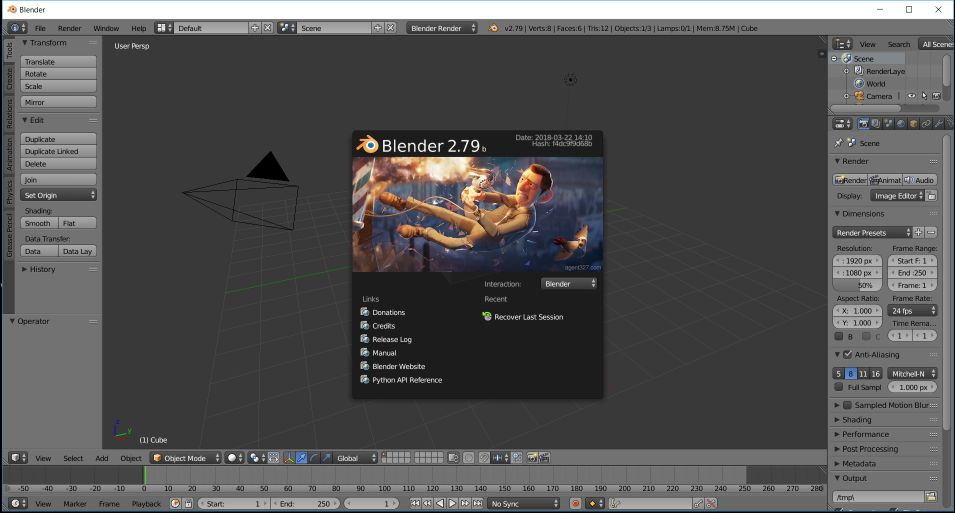
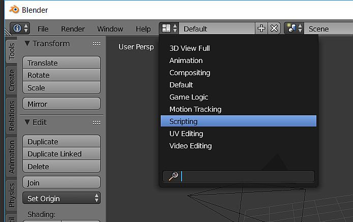
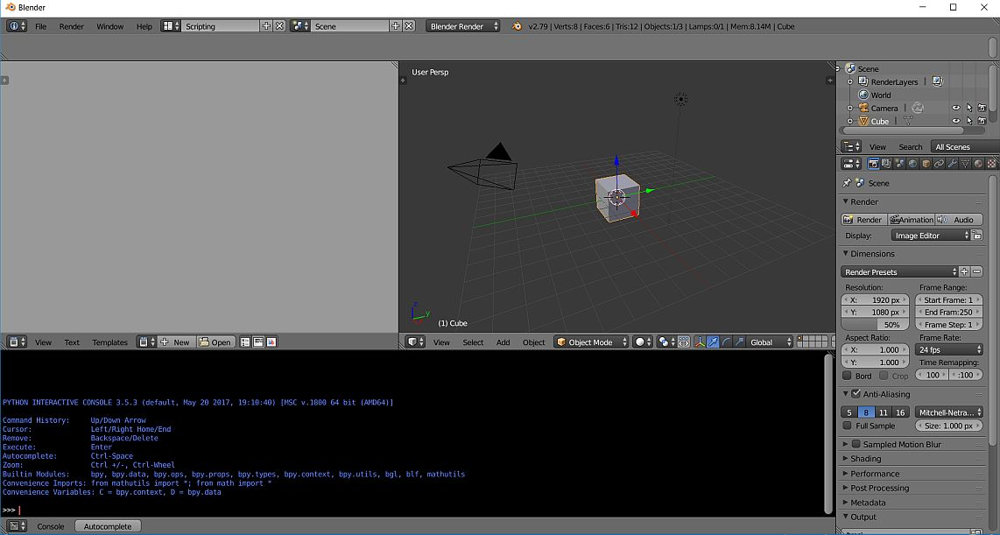
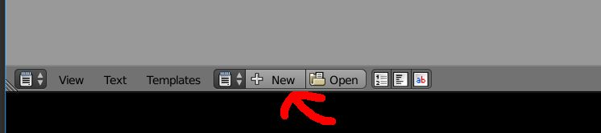
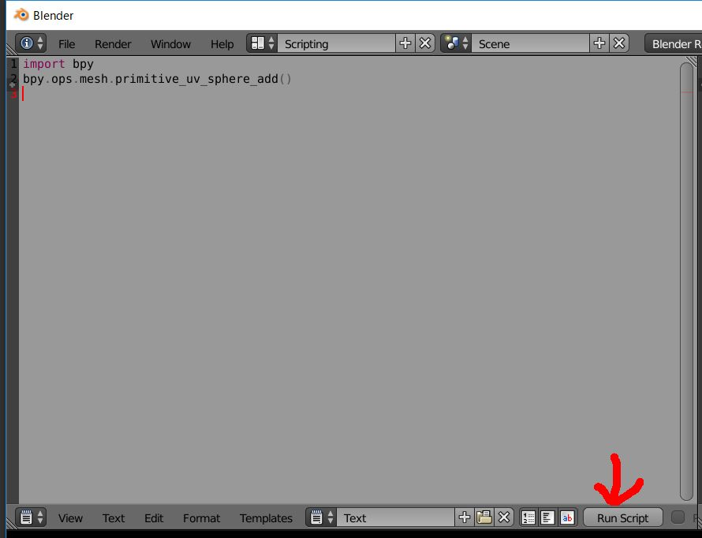
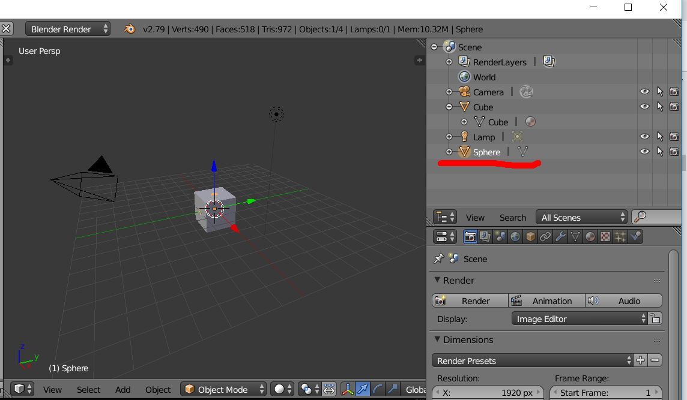
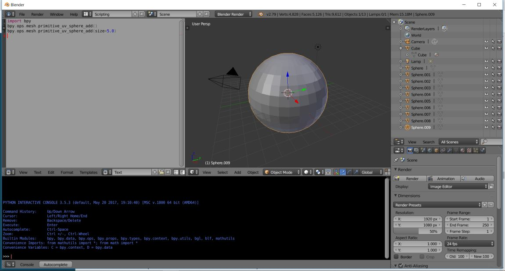

# Lesson001 スクリプトの実行

Blenderを起動します。以下のような画面になると思います。



スクリプトを実行しやすいように画面のレイアウトを変更します。\
画面右上に画面レイアウトを選択するメニューがあるので、そこから\
Scriptingを選択します。



以下のような画面レイアウトになるはずです。\
右側の灰色のエリア(テキストエディタ: Text Editor)を使用します。



テキストエディタの下側にある New ボタンを押します。



テキストエディタに以下のコードを書きます。

```python
import bpy
bpy.ops.mesh.primitive_uv_sphere_add()
```
コードを書いたら Run Script ボタンを押します。



わかりにくいのですが、球体(sphere)が作成されます。\
(Blender起動時に自動で?立方体が作成されていて、この立方体と重なっているため見えなくなっています。)



次に以下のようにコードを書いて、 Run Script ボタンを押します。

```python
import bpy
bpy.ops.mesh.primitive_uv_sphere_add()
bpy.ops.mesh.primitive_uv_sphere_add(size=5.0)
```
そうすると、大きい球体が作成されます。\
(実際には大きい球体の中に小さい球体が作成されています。)



## まとめ
 * 画面のレイアウトを変更できる。今回は Scriptingを選択しました。
 * テキストエディタにコードを書いて、Run Script ボタンを押して実行ができる。\
  今回は球体を作成してみました。